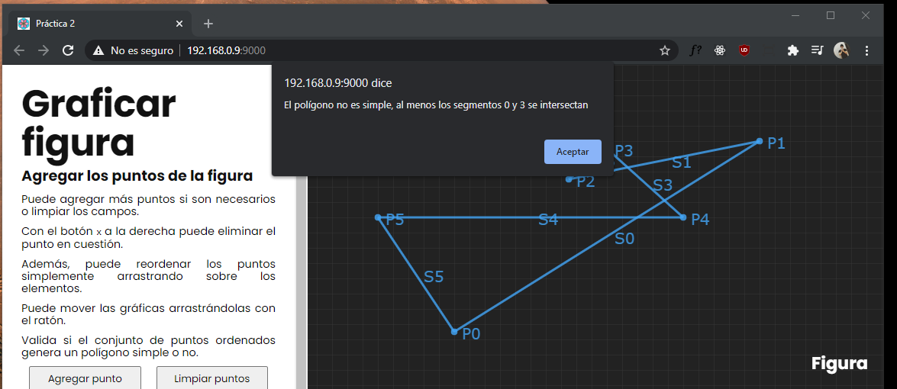

# Gráfica de figuras estrelladas
## Descripción
Este programa permite graficar polígonos y polígonos estrellados dado un conjunto de puntos.

- Puede agregar más puntos si son necesarios o limpiar los campos.
- Con el botón `x` a la derecha puede eliminar el punto en cuestión.
- Además, puede reordenar los puntos simplemente arrastrando sobre los elementos.
- Puede mover las gráficas arrastrándolas con el ratón.
- Valida si el conjunto de puntos ordenados genera un polígono simple o no. (Actualización 23 de Marzo 2021)

### Posible actualización

El cálculo del Kernel de la figura para comprobar si una figura es estrellada o no, y graficar automáticamente su versión extrellada.

## Requisitos - ambiente de desarrollo
- [Node.js](https://nodejs.org/en/) v.15.12.0 o más actual.
- NPM, viene con Node.js
- Conexión a internet para la instalación de dependencias.

## Uso - ambiente de desarrollo

Clonación del repositorio:
```bash
git clone https://github.com/JoelHernandez343/graph-star-shapes-cg.git
cd graph-star-shapes-cg
```

Se instalan las dependencias:
```bash
npm i
```

Se inicia el servidor de desarrollo (automáticamente abre el navegador)
```bash
npm start
```

Para construir la versión de producción:
```bash
npm run build
```

## Uso - sin necesidad de Node.js
Cuidado, puede que el archivo .zip contenga una versión antigua del proyecto.

Descargue el archivo [`dist-<fecha>-v<n>.zip`](https://drive.google.com/drive/folders/1RDfikT-g2usCdKXhdH8udqDQb8f5OwMX?usp=sharing) alojado en Google Drive.

Descomprímalo y abra `index.html` con su navegador de preferencia.

## Capturas
Polígono simple:


Polígono no simple:

